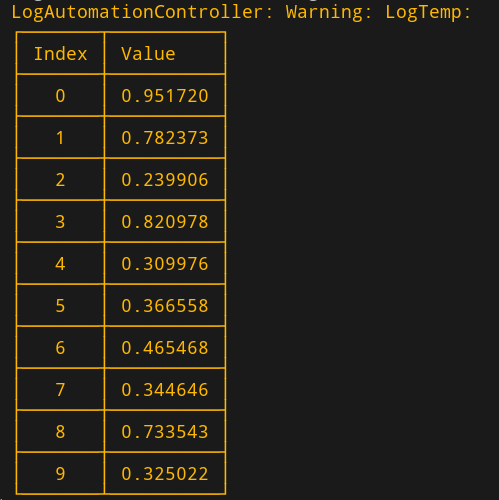
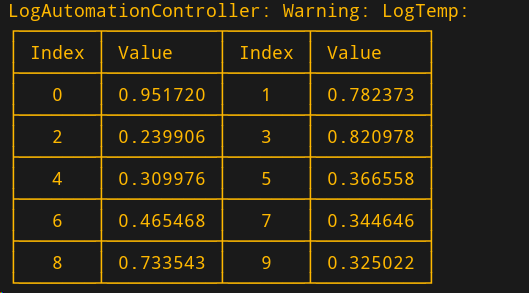
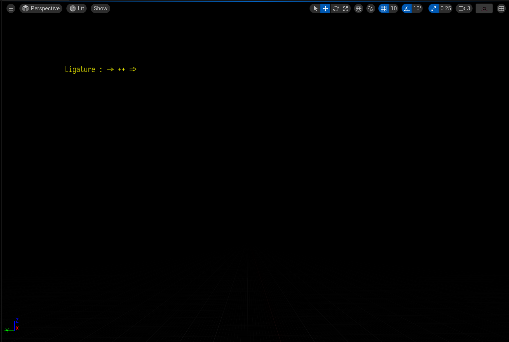
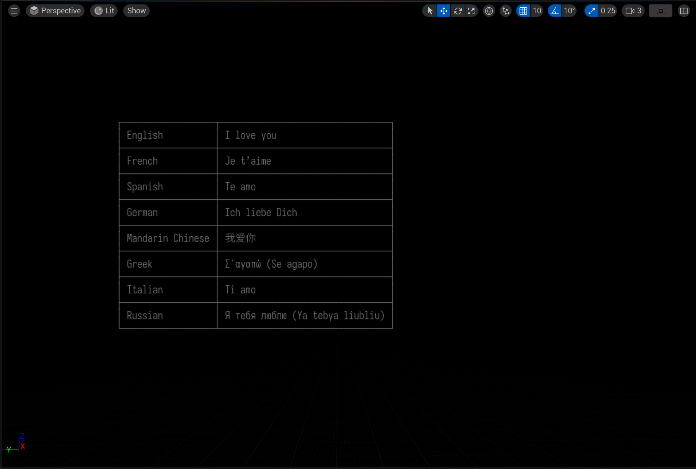
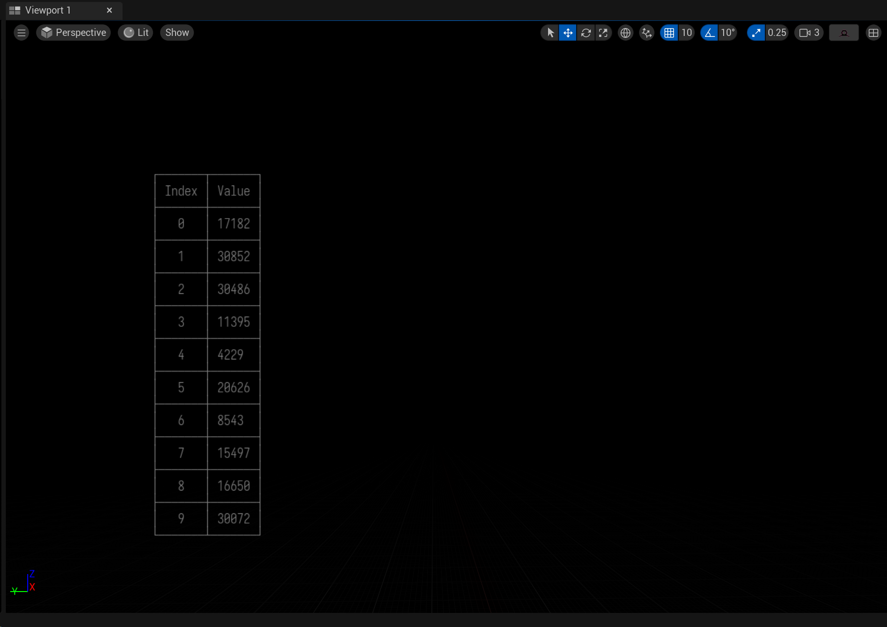

## UE tabulate plugin

[p-ranav/tabulate: Table Maker for Modern C++ (github.com)](https://github.com/p-ranav/tabulate)

**Test:**

- [x] UE 5.4.4

## Example

**Draw to screen**

## How to run unittest

change Tabulate.uplugin `TabulateTest` module `LoadingPhase` to `Default`， it will load unittest.

## Chinese support

need use 1:2 font, such as [lxgw/LxgwWenKai: An open-source Chinese font derived from Fontworks' Klee One. 一款开源中文字体，基于 FONTWORKS 出品字体 Klee One 衍生。 (github.com)](https://github.com/lxgw/LxgwWenKai)
